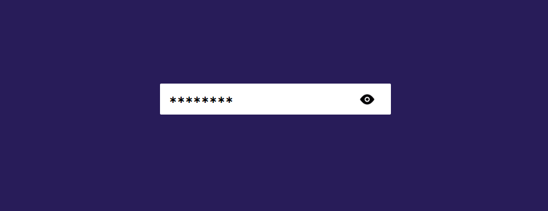
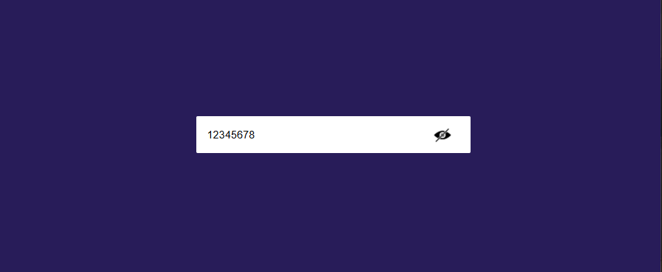

# 🔐 Password Show / Hide Toggle

A clean and simple password input field built with **HTML, CSS, and JavaScript** that allows users to toggle between hidden and visible password states.

---

## ✨ Features

- 👁️ Toggle password visibility
- 🔄 Dynamic icon switching (hide ↔ show)
- ⚡ Real-time input masking using JavaScript
- 🎯 Minimal and clean UI design
- 📱 Easy to integrate into any project

---

## 📸 Preview

### 🔒 Hidden Password


### 👁️ Visible Password


---

## 🛠️ How It Works

- The password is stored temporarily in JavaScript.
- When the user clicks the icon:
  - The password is replaced with `✱✱✱✱✱`
  - The original password is preserved internally
- Clicking again restores the original password.
- The icon updates dynamically based on state.

---

## 📂 Project Structure
PasswordHideShow/
│── index.html
│── style.css
│── script.js
│── icons/
│ ├── hide-icon.png
│ └── show-icon.png
│── preview/
│ ├── hidden.PNG
│ └── shown.PNG


---

## 🚀 Getting Started

1. Clone the repository:
```bash
git clone https://github.com/samuel-fikiru/PasswordHideShow.git
